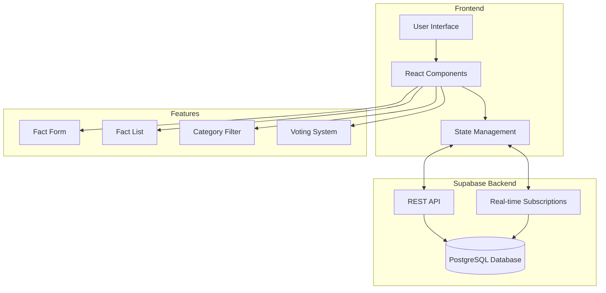

# Yanbo Guan - Fact Sharing Application

A dynamic fact-sharing platform where users can share and discover interesting facts across various categories.

## Live Demo

Visit the live application: [Share a Fact App](https://shareafact-jason.netlify.app/)

## Application Architecture

The following diagram illustrates the high-level architecture of the application:



## Backend Architecture

The application uses Supabase as a Backend-as-a-Service (BaaS) solution, providing:

### Database Management

- PostgreSQL database hosted on Supabase
- Real-time data synchronization
- Automated database scaling
- Built-in data validation

### API Features

- RESTful API endpoints
- Real-time subscriptions
- Automatic API documentation
- Secure data access

### Database Operations

- Create: Insert new facts with validation
- Read: Fetch facts with filtering and sorting
- Update: Manage vote counts and fact status
- Delete: (Reserved for future implementation)

## Author

Yanbo Guan

## Overview

Today I Learned is a modern web application that allows users to share and interact with interesting facts across various categories. Users can post facts, categorize them, and vote on their authenticity and interest level.

## Features

### 1. Fact Management

- Create and share new facts with source URLs
- Character limit counter for fact submissions (200 characters)
- URL validation for source links
- Real-time fact updates

### 2. Category System

- Multiple predefined categories with unique color coding
- Category-based filtering
- Dynamic category selection in fact submission form

### 3. Voting System

- Three types of votes:
  - Interesting (👍)
  - Mindblowing (🤯)
  - False (⛔️)
- Automatic dispute flagging based on vote ratio
- Real-time vote updates

### 4. User Interface

- Clean and responsive design
- Loading states for better user experience
- Toggle-able fact submission form
- Empty state handling for categories
- Fact counter displaying total facts in the database

## Technical Implementation

### Frontend

- Built with React.js
- Uses modern React patterns:
  - Functional components
  - React Hooks (useState, useEffect)
  - Props for component communication
  - Conditional rendering
  - Component composition

### State Management

- Local state management using React useState
- Efficient state updates and props drilling
- Real-time state synchronization with database

### Backend Integration

- Supabase integration for backend services
- Real-time database operations through Supabase client
- Asynchronous data fetching with error handling
- Database queries with filtering and sorting capabilities
- Optimized connection pooling
- Automatic table relationships
- Row-level security policies
- Built-in authentication (ready for implementation)

### Data Flow

- Optimistic updates for better UX
- Proper error handling and loading states
- Efficient data filtering and sorting

### Styling

- Custom CSS implementation
- Dynamic styling based on categories
- Responsive design elements
- Interactive UI elements

## Data Structure

### Fact Object

```javascript
{
  id: number,
  text: string,
  source: string,
  category: string,
  votesInteresting: number,
  votesMindblowing: number,
  votesFalse: number,
  createdIn: number
}
```

### Categories

Pre-defined categories with associated colors:

- Technology (#3b82f6)
- Science (#16a34a)
- Finance (#ef4444)
- Society (#eab308)
- Entertainment (#db2777)
- Health (#14b8a6)
- History (#f97316)
- News (#8b5cf6)

## Performance Features

- Optimized re-rendering with proper state management
- Efficient list rendering with unique keys
- Controlled form inputs
- Debounced user interactions
- Proper loading state handling

## Future Enhancements

- User authentication
- Fact editing and deletion
- Comment system
- Advanced sorting options
- Share functionality
- Mobile app version
